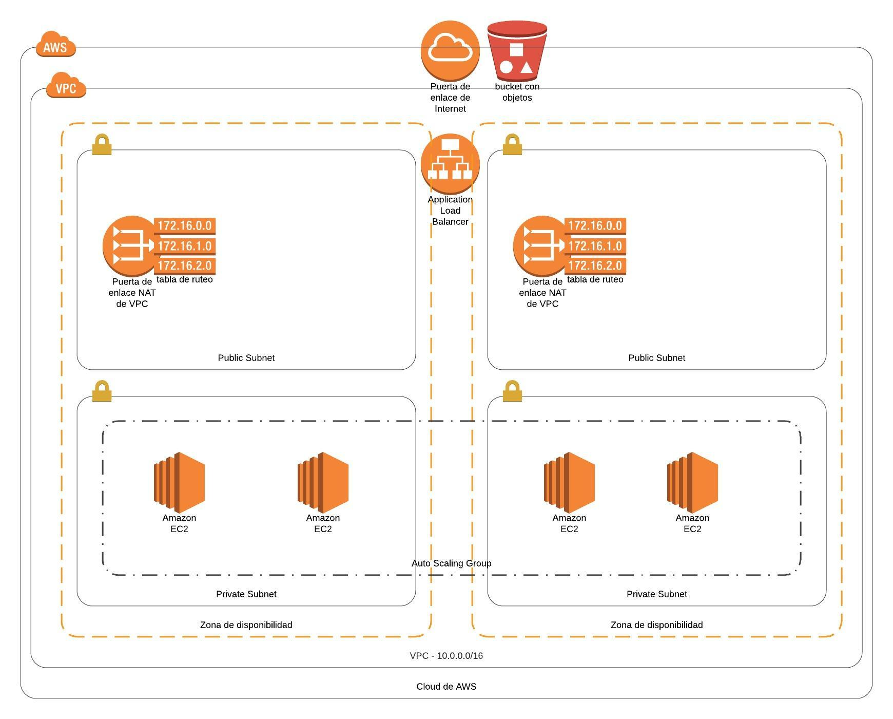

# Deploy a highly available web application using CloudFormation

This includes the YAML files and the JSON files. The YAML files create the environment (network and servers) as shown below and the JSON file serve as input parameters to the environment.

## Architecture Diagram



 The project contains:

 * **udagram-network.yml** file is for creating the network VPC, Subnets etc. using the
 * **udacity-servers.yml** creates the servers which include the Load Balancer, AutoScaling Groups and Security Groups are created using
 * **udagram-parameters.json** as input parameters.

## Instructions

First create the Udagram-Network as below:

```
create Udagram-Network using ./create.sh udagram-network udagram-network.yml udagram-parameters.json
```
Next create the Udagram-Servers Stack by running the create.sh file:

```
./create.sh udagram-network udagram-network.yml udagram-parameters.json
```
